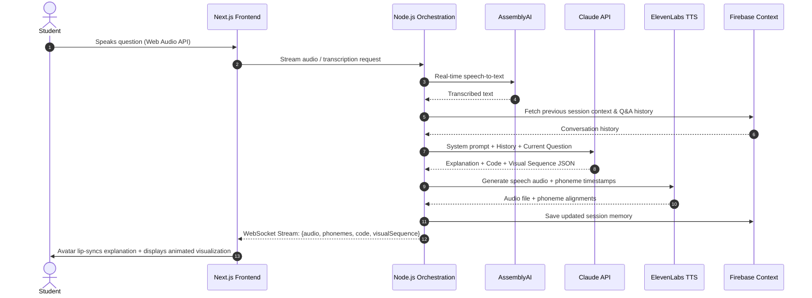

# System Architecture

## Overview

The AI Teaching Assistant is an interactive, voice-first learning platform specifically designed for Data Structures & Algorithms. It combines real-time speech transcription, LLM pedagogical intelligence, procedural 3D avatar animation, and synchronized visual algorithm execution.

## End-to-End Data Flow

## Detailed 7-Step Workflow

1. **Student Asks Question**: Spoken through browser microphone via Web Audio API or entered as text.
2. **Backend Processing**: Node orchestration engine retrieves conversation history and builds pedagogical system prompt.
3. **Claude Generation**: Claude produces structured JSON with explanation text, executable code snippets, and step-by-step visual animation directives.
4. **TTS & Phoneme Extraction**: ElevenLabs returns speech audio and phoneme-level timings for lip synchronization.
5. **Frontend Rendering**: Three.js avatar moves mouth and changes facial expressions in sync with speech while algorithm steps animate on canvas.
6. **Context Storage**: Session memory is updated in Firebase.
7. **Follow-Up Ready**: Next student question retains context (e.g., "What if the array is already sorted?").
